<picture>
  <source media="(prefers-color-scheme: dark)" srcset="icons/dodecaedro-escuro.svg">
  
</picture>

### Hi, I'm João, a Computer Engineer!

- Ask me about **Programming and History**
- Check out my Medium posts [here](https://medium.com/@mor0_joao)

### Currently building

My personal site

### Open Source

I contribute to the community by fixing what I find along the way — including a merged PR in [GoAnime](https://github.com/alvarorichard/GoAnime) (1.1k ⭐) and accepted answers in projects like [kitty](https://github.com/kovidgoyal/kitty/discussions/10260) (33k ⭐) and Brazilian dev communities.

 

### Connect with me:

### Languages:

 
